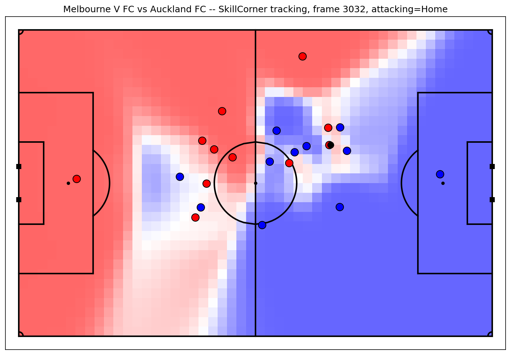
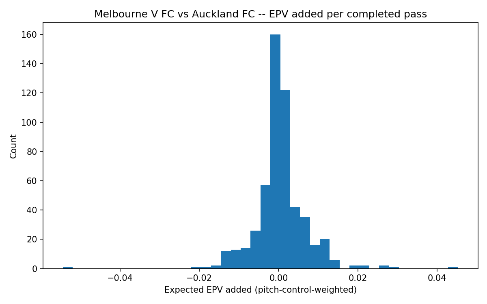
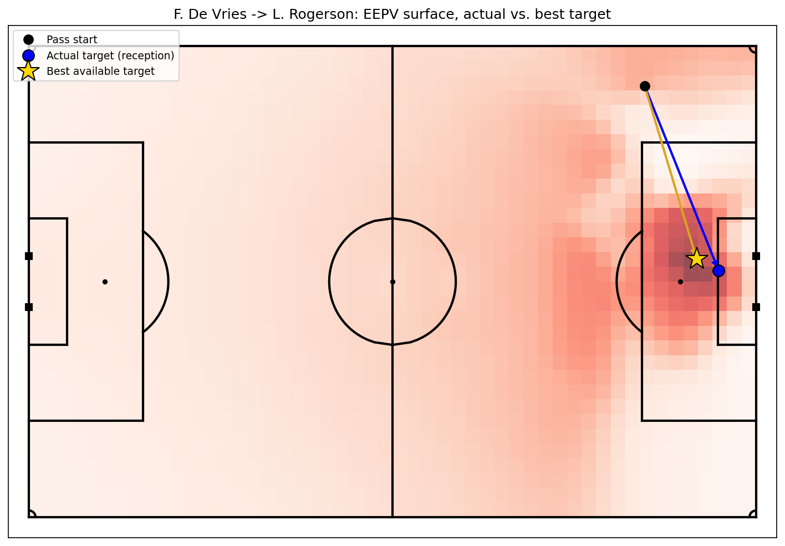

# Who controlled the pitch? Melbourne Victory vs Auckland FC

*A look at one real match through two ideas from football analytics: pitch control
and expected possession value (EPV).*

## The match

**Melbourne Victory 0–1 Auckland FC**, A-League Men 2024–25, **Semi-Final Leg One**,
played 17 May 2025 at AAMI Park in Melbourne. Auckland FC — an expansion club playing
their debut season — won away from home to reach the final.

Official highlights: [Melbourne Victory v Auckland FC – Shark Highlights | Isuzu UTE A-League 2024-25 | Semi-Final Leg One](https://www.youtube.com/watch?v=xgAaEqw_SK4)

The data behind this analysis comes from [SkillCorner](https://github.com/SkillCorner/opendata),
a company that tracks every player's position on the pitch, ten times a second, from
broadcast camera footage — the same idea as the chip-in-the-boot tracking systems used
at elite clubs, just extracted from the TV picture instead.

## Idea 1: Pitch control — who "owns" a piece of grass?

Imagine pausing the match at any moment and asking: *if the ball were played to this
exact spot on the pitch right now, which team would actually get there first?*

That's not a simple "who's closest" question. A defender standing five metres away but
already sprinting the wrong direction might lose a race to an attacker eight metres
away but already accelerating toward the ball. **Pitch control** answers this properly
for every point on the pitch at once, using each player's real position *and* real
speed and direction at that instant, to estimate who would win a footrace to any given
spot.

The result is a map of the whole pitch, coloured by which team is favoured to control
each area:

Red is space Melbourne Victory (in red) are favoured to win; blue is Auckland FC's.
Notice it isn't a clean line down the middle — the boundary bends around where players
actually are and how fast they're moving, which is exactly the point: a simple "closest
player wins" map would draw much straighter, less realistic borders.

## Idea 2: EPV — how much is a piece of grass actually worth?

Pitch control tells you *who's likely to get the ball* somewhere. It says nothing about
whether that somewhere is dangerous. A team might dominate space near their own corner
flag — worth almost nothing — or contest a much smaller pocket of space just outside
the opponent's box, worth a great deal.

**Expected Possession Value (EPV)** is a second map, layered on top: for every point on
the pitch, based on where thousands of real possessions have historically ended up, how
likely is having the ball *there* to eventually produce a goal? Central areas near goal
score highly; your own defensive third scores close to zero.

Multiply the two maps together — *likely to get there* × *valuable if you do* — and you
get the actual expected value of playing the ball to any spot. That's what lets us
score an individual pass: how much did the team's expected chance of scoring change
because of this specific pass, given how contested the destination really was?

## Every pass in the match, scored

**536 completed passes** were run through this calculation — every successful pass in
the match with a valid reception point, covering all 90-plus minutes including every
substitution (an earlier version of this analysis only covered a partial window and
scored 322; see the note at the end of this section). Most cluster close to zero — a
short, safe sideways pass barely moves the needle either way. A smaller number of
forward, progressive passes clearly add value; a few risky ones lose it:

**Top five passers by total value added** (players with at least 5 passes):

| Player | Team | Passes | Average value per pass | Total value added |
|---|---|---|---|---|
| F. De Vries | Auckland FC | 14 | 0.0052 | 0.0732 |
| Z. Machach | Melbourne Victory | 33 | 0.0021 | 0.0679 |
| J. Duncan | Melbourne Victory | 9 | 0.0047 | 0.0423 |
| N. Moreno | Auckland FC | 8 | 0.0052 | 0.0417 |
| L. Jackson | Melbourne Victory | 45 | 0.0009 | 0.0391 |

(Full list: `SkillCorner_EPV_leaderboard.csv`.)

*Getting to full match coverage meant fixing a real substitution-handling limitation:
computing player speed requires smoothing each player's tracked positions over time,
which breaks if a substitute's data is missing for the 60+ minutes before they come on.
The fix reads the match in chunks that never span a substitution — one stretch per
unbroken run of the same 22 players on the pitch (7 such stretches in the second half
alone) — computes speed within each stretch separately, then stitches the results back
together.*

## Was it actually the smartest pass available?

For one pass — the single highest-value one found — we went further and asked the
model a different question: forget what actually happened, *given everyone's position
at that instant, where was the single best place on the whole pitch this player could
have played the ball?*

F. De Vries's pass to L. Rogerson (blue dot), right at the edge of the six-yard box,
lands essentially on top of the model's own, independently-computed "best possible
target" (gold star) — both sit inside the single most valuable patch of the surface.
The model wasn't just marking the pass after the fact — handed the same information the
player had in real time, it arrives at essentially the same decision (by the numbers,
the actual pass even edges out the grid search slightly, since the search only checks a
grid of points and the real reception spot isn't required to land exactly on one). A
small but genuinely satisfying check: the numbers agree with what a good footballer
actually did.

## How to develop this analysis further

This first pass only used a thin slice of what's actually in SkillCorner's data — the
positions, and a filtered list of successful passes. Concrete next steps, roughly in
order of how much new work each needs:

**Using data we already have, no new downloads:**

- **Compare our numbers against SkillCorner's own.** Their event log already includes
  its own estimate of a pass's difficulty and threat (`xthreat`, `xpass_completion`),
  computed independently of our pitch-control model. Plotting ours against theirs,
  pass by pass, is a direct check on whether the two approaches agree — and if they
  don't, *where* they disagree is often the more interesting finding.
- **Bring in off-ball runs, already tagged.** SkillCorner's event log separately lists
  hundreds of off-the-ball sprints in this match, each already classified by type,
  without needing to infer anything from raw tracking. Scoring how much space or value
  each run created (the same pitch-control idea, applied to a player who never touches
  the ball) would extend this from "who passed well" to "who moved well."
- **Use exact playing time.** Rather than approximating minutes from event timestamps,
  the match file records precisely how long each player was on the pitch, split into
  time spent with their team in and out of possession — a more accurate basis for any
  per-90 comparison between players.
- **Look at pressing and defensive shape.** The data tracks how compact each team's
  defensive line is and how quickly it shifts, frame by frame — a different lens on the
  same tracking data, focused on defending rather than passing.

**Needing more data, still freely available:**

- **Expand to the other 9 matches.** This dataset covers ten A-League matches in total.
  Running the same pipeline across all of them turns "how one player performed in one
  match" into an actual sample size — enough to start comparing players and teams
  meaningfully rather than describing a single game.

## Takeaways

1. **Pitch control and EPV are two different questions** — who gets the ball, and how
   much that matters — and multiplying them together is what actually lets you score a
   pass.
2. **The best pass in the match, by this measure, was also the one the model would have
   picked itself** — a real, if small, vote of confidence in the approach.
3. **This is one match out of ten available**, and one pass examined closely out of
   536 — a demonstration of the method, not a verdict on any player.
